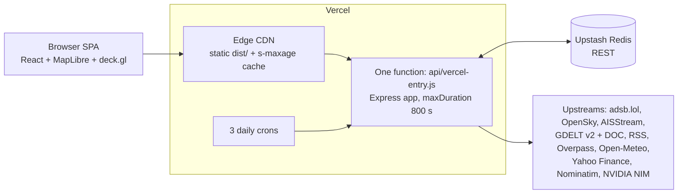

# Architecture

How Iran Monitor is built, as of 2026-09. Describes the system as it is, including what does not work.
Related: [`OPERATIONS.md`](./OPERATIONS.md) (failure playbooks, operator actions), [`redis-keys.md`](./redis-keys.md) (every Redis key), [`AUDIT-2026-09.md`](./AUDIT-2026-09.md) (open defects), [`adr/`](./adr/README.md) (why decisions were made), [`../server/openapi.yaml`](../server/openapi.yaml) (API contract), [`../.env.example`](../.env.example) (every env var).

## 1. System at a glance



- The browser polls `/api/*` on fixed intervals. There is no WebSocket or push channel to the client.
- Every `/api/*` and `/health` request is rewritten to a single serverless function running an Express app.
- Routes are cache-first: read Redis, serve if fresh, otherwise fetch upstream, write Redis, serve. The CDN sits in front with short `s-maxage` values.
- Redis is the only shared state. It is REST-based (no connections to manage). A per-instance in-memory map is the fallback when Redis is unreachable.
- Three crons run once a day (UTC): `00:00` health + eval, `04:00` LLM event extraction, `12:00` Overpass pre-warm.
- The LLM enrichment of conflict events is optional. When it produces nothing, the map serves raw GDELT events. That is the current production state (see §5).
- Single operator. No user accounts. One shared secret (`DASHBOARD_PASSWORD`) unlocks the operator console and bypasses rate limits.

## 2. Repo layout and build

| Path                                            | Contents                                                                                                                                                                                         |
| ----------------------------------------------- | ------------------------------------------------------------------------------------------------------------------------------------------------------------------------------------------------ |
| `src/`                                          | React client. `components/`, `hooks/`, `stores/` (Zustand), `lib/` (pure logic), `types/`, `styles/app.css`, `test/__mocks__/`                                                                   |
| `src/data/`                                     | Static JSON. Client-used: `countries.json`, `disputed.json`, `ethnic-zones.json`. Server-only despite the location: `aqueduct-basins.json`, `rivers.json`, `sites.json`, `water-facilities.json` |
| `server/`                                       | Express app. `adapters/` (one per upstream), `routes/`, `lib/`, `middleware/`, `cache/`, `schemas/`, `config.ts`, `types.ts`, `openapi.yaml`                                                     |
| `server/data/`                                  | `actor-catalog.ts`; `eval/` fixtures (`ground-truth-events.json`, `adversarial-injections.json`)                                                                                                 |
| `api/vercel-entry.js`                           | tsup bundle of the server. Tracked in git (Vercel needs the file to exist for function discovery); rebuilt on every deploy. The committed copy is usually stale                                  |
| `scripts/`                                      | Operator and one-off tools (`refresh-sites`, `refresh-water-facilities`, `eval-replay`, `probe-openrouter`, `load-test.js`, `capture-hero`, …) run through `npm run` aliases                     |
| `tests/`, `src/__tests__/`, `server/__tests__/` | Vitest suites (jsdom for client, node for server)                                                                                                                                                |

**Entry points.** `server/index.ts` exports `createApp()` and, when run directly, listens on `PORT` (dev: 3001, Vite proxies `/api` to it). `server/vercel-entry.ts` builds the app once at module load and exports a `(req, res)` handler; if `createApp()` throws (for example env validation), every request gets a 500 containing the error.

**`npm run build`** does three things: `vite build` → `dist/`; `tsup server/vercel-entry.ts` → `api/vercel-entry.js` (single ESM file, no splitting); copy `server/data/eval/*.json` → `api/_eval/` (shipped through `vercel.json` `includeFiles`). It does not typecheck. `npm run typecheck` (`tsc -b` + `type-coverage`) is separate. Node engine is `22.x`.

**Client/server boundary.** The client imports types from `server/types.ts`. Domain constants (`IRAN_BBOX`, `IRAN_CENTER`, `WAR_START`, `ADSB_RADIUS_NM`) are defined twice, in `src/lib/domain.ts` and `server/config.ts`; `src/__tests__/domain.test.ts` fails if they differ.

## 3. Data sources

Logical TTL decides `stale`; hard TTL is the Redis expiry. All values verified in code.

| Source                      | Adapter (`server/adapters/`)  | Route                         | Redis key                       | Logical / hard TTL | Client poll   | Auth                     |
| --------------------------- | ----------------------------- | ----------------------------- | ------------------------------- | ------------------ | ------------- | ------------------------ |
| Flights, adsb.lol (default) | `adsb-lol.ts`                 | `/api/flights`                | `flights:adsblol`               | 30 s / 300 s       | 5 s           | none                     |
| Flights, OpenSky            | `opensky.ts`                  | `/api/flights?source=opensky` | `flights:opensky`               | 10 s / 100 s       | —             | OAuth client id + secret |
| Ships                       | `aisstream.ts`                | `/api/ships`                  | `ships:ais`                     | 30 s / 300 s       | 30 s          | `AISSTREAM_API_KEY`      |
| Conflict events (raw)       | `gdelt.ts`                    | `/api/events`                 | `events:gdelt`                  | 15 min / 2.5 h     | 15 min        | none                     |
| Conflict events (enriched)  | `lib/llmEventExtractor.v3.ts` | `/api/events`                 | `events:llm:v3`                 | 15 min / 48 h      | same          | `NVIDIA_NIM_API_KEY`     |
| News                        | `gdelt-doc.ts`, `rss.ts`      | `/api/news`                   | `news:feed`                     | 15 min / 2.5 h     | 15 min        | none                     |
| Key sites                   | `overpass.ts`                 | `/api/sites`                  | `sites:v3`                      | 24 h / 3 d         | once on mount | none                     |
| Water facilities            | `overpass-water.ts`           | `/api/water`                  | `water:facilities:v4`           | 24 h / 7 d         | once on mount | none                     |
| Precipitation               | `open-meteo-precip.ts`        | `/api/water/precip`           | `water:precip`                  | 6 h / 1 d          | 6 h           | none                     |
| Weather grid                | `open-meteo.ts`               | `/api/weather`                | `weather:open-meteo`            | 30 min / 5 h       | 30 min        | none                     |
| Markets                     | `yahoo-finance.ts`            | `/api/markets?range=`         | `markets:yahoo:{1d,5d,1mo,ytd}` | 5 min / 50 min     | 5 min         | none                     |
| Reverse geocode             | `nominatim.ts`                | `/api/geocode`                | `geocode:{lat},{lon}` (2-dp)    | 30 d / 90 d        | on demand     | none                     |

Poll intervals are `VITE_POLL_*` env vars with the defaults shown. `/api/sources` reports which credentialed sources are configured.

### Flights

- The client is hard-wired to adsb.lol: `flightStore.activeSource` is `'adsblol'` and nothing calls `setActiveSource`. OpenSky works server-side but has no UI path and is not configured in production. ADS-B Exchange was removed; only a dead `ADSB_EXCHANGE_API_KEY` schema entry remains.
- adsb.lol rejects requests without a real `User-Agent` (403). Every outbound fetch to it must send `OUTBOUND_USER_AGENT` from `server/config.ts`. Node's default UA broke production flights for weeks.
- adsb.lol returns the ADS-B v2 JSON shape, normalized by `adsb-v2-normalize.ts`. Query is a 1200 NM radius around `IRAN_CENTER` (28 N, 45 E). `FlightEntity.data.unidentified` marks hex-only / no-callsign aircraft.
- The client clears flights after 60 s without fresh data (`VITE_STALE_FLIGHT_MS`). At 250 m/s a plane moves ~15 km per minute; showing it would be wrong.
- Hard TTL is only 5 minutes, so a longer upstream outage leaves nothing to serve stale, and the route rethrows an untyped error (HTTP 500 instead of 502). Open defect.

### Ships

- A serverless function cannot hold a socket. Each request opens the AISStream WebSocket, collects for 5 s (`AISSTREAM_COLLECT_MS`), closes, merges with the cached list by MMSI, and drops ships not seen for 10 minutes. Client stale threshold is 120 s.
- No `AISSTREAM_API_KEY` ⇒ the adapter throws and, with nothing cached, the route answers 500 `UPSTREAM_ERROR`. It is not a silent "empty list", whatever older docs said.

### GDELT v2 (raw conflict events)

- The master list URL is plain `http://` on purpose: GDELT's TLS certificate is chronically broken.
- Exports are ZIP files. Node's `zlib` cannot read ZIP; `adm-zip` is the dependency for that.
- Country codes are FIPS 10-4, not ISO (IZ = Iraq, TU = Turkey, IS = Israel). `parseSqlDate` builds dates with `Date.UTC()`; local time shifts events by a day.
- GDELT geocodes many events to a city or country centroid, and the rows are noisy. Filtering in `parseAndFilter` (`gdelt.ts`), in order: CAMEO root 18/19/20 only → excluded base codes (`EVENT_EXCLUDED_CAMEO`) → Middle-East FIPS set → `isGeoValid` (ActionGeo full name must not contradict the FIPS code) → `NumSources ≥ EVENT_MIN_SOURCES` (2) → at least one actor country → dedupe by id keeping most mentions → confidence score ≥ `EVENT_CONFIDENCE_THRESHOLD` (0.35), with a penalty for detected centroids and an optional Bellingcat corroboration boost. No single filter is enough; an earlier attempt to fix geolocation with NLP post-processing was scrapped ([ADR-0005](./adr/0005-phase-26-2-nlp-approach-scrapped.md)).
- Raw CAMEO base codes map to the 5 event types through `classifyByBaseCode`. This is what the map shows when LLM enrichment is absent.
- `events:gdelt` is an accumulator: fresh rows are merged by id into the cached set, rows before `WAR_START` (2026-02-28) are pruned. Logic lives in `server/lib/rawEventsRefresh.ts` (`refreshRawEvents`), shared by the route and the cron.
- Backfill: when the accumulator is empty (or `?backfill=true`), the route downloads 4 files per day since `WAR_START`, 5 at a time, with a 1 h cooldown (`events:backfill-ts`). The downloads have no timeout, and the volume grows every day. The cron never backfills (`skipBackfill`), and when it starts from an empty accumulator it does not persist its backfill-less result, so the next cold route request still backfills. Open defect: the backfill itself (unbounded, no timeouts, on the request path).
- GDELT publishing pauses on holidays. The hard TTL (2.5 h) and stale-serve cover short gaps only.

### News

- GDELT DOC (`ArtList`, 24 h, 250 records) plus six RSS feeds (BBC Middle East, Al Jazeera, Tehran Times, Times of Israel, Middle East Eye, Bellingcat). Both are best-effort: GDELT DOC rate-limits by IP and the block can last hours across the whole function pool, so a DOC failure must not fail the route. `news:feed:rss-only` records when the feed was built without DOC.
- Without clustering GDELT DOC returns dozens of near-identical articles. See §8.
- `news:feed` is also the news context for the LLM prompt and the Bellingcat corroboration input.

### Sites and water (Overpass)

- Overpass is slow and flaky. Primary `overpass-api.de`, fallback `overpass.private.coffee`. Results cache for 24 h and the `12:00` cron re-pulls both.
- Resolution order in the routes: Redis → committed snapshot (`src/data/sites.json`, `src/data/water-facilities.json`, loaded by `server/lib/sitesSnapshot.ts` / `waterSnapshot.ts`) → live Overpass. **In production the snapshot step is dead:** the files are read with `readFileSync` at a path that does not exist in the deployed function (they are not in `includeFiles`), so a cold Redis miss goes straight to Overpass on the request path. Refresh snapshots with `npm run refresh:sites` / `refresh:water`.
- Site types: `nuclear | naval | oil | airbase | port`. Water types: `dam | reservoir | desalination` (desalination moved from sites to water).
- Water admission gate: a facility needs a usable Latin-script name. Non-Latin names are romanized (`server/lib/romanize.ts`, `transliteration` package) before the gate; the original is kept in `nameOriginal`. Do not loosen the name gate to recover missing facilities: that re-admits generic "Dam near X" labels. The real cause of past drops was the spatial dedup, now name-aware and deterministic (`spatialDedup` in `overpass-water.ts`).
- Any change that alters what is stored under a key must bump the key version (`sites:v3`, `water:facilities:v4`); otherwise the old payload hides the change for up to the hard TTL.
- Water stress: WRI Aqueduct 4.0 baseline per basin, modified by a 30-day precipitation anomaly from Open-Meteo. Aqueduct ships no basin centroids, so `server/lib/basinLookup.ts` assigns basins via the nearest country centroid. Coarse, known limitation.

### Markets, weather, geocode

- Yahoo Finance is an unofficial API: it blocks stale User-Agents and sometimes returns a CAPTCHA page. One batched call covers all five tickers (Brent, WTI, XLE, USO, XOM).
- Weather is a 1-degree Open-Meteo grid (lat 15–42, lng 30–70), fetched server-side only.
- Nominatim: 1 request per second, identified User-Agent. Forward geocoding for the LLM resolver is constrained to a Middle-East viewbox and country list (`server/lib/meBounds.ts`), cached under `geocode:fwd:constrained:v2:{hash}` for 30 d / 90 d, including misses. The miss cache is correct in steady state, but a fetch without a timeout once cached misses for hung connections; keep `NOMINATIM_FETCH_TIMEOUT_MS` and flush the miss cache after any geocoder fix.

## 4. Caching and degradation

**Entry shape.** `server/cache/redis.ts` stores `{ data, fetchedAt }`. `cacheGet(key, logicalTtlMs)` returns `{ data, stale, lastFresh }`; `stale` is computed from `fetchedAt`, not from Redis expiry. The hard TTL is normally 10× the logical TTL so stale data survives upstream outages. The TTL is an argument of each write, not a property of the key: writers must import the shared constant (`LLM_TERMINAL_TTL_SEC`, `WATER_REDIS_TTL_SEC`, …). A literal TTL at a new call site has shortened caches silently before.

**Safe wrappers.** `cacheGetSafe` / `cacheSetSafe` race every Redis call against a 2 s timeout (`REDIS_OP_TIMEOUT_MS`) because the Upstash client retries forever when the URL is wrong or the network is partitioned. On failure they fall back to a process-local `Map` and mark the response `degraded: true`. `cacheSetSafe` swallows every error without logging. That is right for poll caches and wrong for the one expensive write of the LLM run (§5).

**Key prefix.** `CACHE_KEY_PREFIX` namespaces every key (dev uses `dev:`). It must be empty in production: it was once set to `dev: ` there and every reader looked at the wrong namespace for a month. `parseEnv` now refuses to start when `VERCEL_ENV=production` and the prefix is non-empty, but `redis.ts` reads the variable directly, so scripts that import `redis` without `config.ts` bypass the guard.

**Response envelope.** `{ data, stale, lastFresh, degraded? }`. Flights, events, sites and water responses go through `sendValidated` (`server/middleware/validateResponse.ts`): a Zod schema mismatch throws in dev/test and only logs a warning in production.

**CDN headers.** `server/middleware/cacheControl.ts` emits `public, max-age=0, s-maxage=N, stale-while-revalidate=M` (or `no-store` for 0/0), applied per route in `server/index.ts`:

| Route          | s-maxage |    swr | Route                                    | s-maxage |    swr |
| -------------- | -------: | -----: | ---------------------------------------- | -------: | -----: |
| `/api/flights` |      5 s |   25 s | `/api/markets`                           |     30 s |   30 s |
| `/api/ships`   |     10 s |   20 s | `/api/weather`                           |   10 min | 20 min |
| `/api/events`  |    5 min | 10 min | `/api/sites`, `/api/water`               |      1 h |   23 h |
| `/api/news`    |    5 min | 10 min | `/api/geocode`                           |     24 h |   24 h |
| `/api/sources` |    1 min |  1 min | dashboard, operator-status, audit-status | no-store |      — |

**Rate limits.** `server/middleware/rateLimit.ts`, `@upstash/ratelimit` sliding window, keyed by client IP. A global `public` tier (60/min, prefix `ratelimit:public`) runs first, then one tier per route (prefix `ratelimit:prod:<tier>`): flights 120, ships 60, markets 30, sources 30, events 20, news 20, weather 10, sites 10, geocode 10, water 10 per minute. Each tier needs its own prefix; they once shared one counter, so flight polling exhausted the 10/min tiers. A valid `DASHBOARD_PASSWORD` Bearer (constant-time compare) skips every tier. The limiter is skipped outside production/Vercel, and proceeds (degrades open) when Upstash errors. 429s are counted per tier per day in `ratelimit:429:{tier}:{date}`. Health and cron routes are mounted before the limiter. Each limiter check costs Redis commands, so the Upstash daily command budget is a design constraint, not only a deployment one.

**Contracts.**

- A Redis failure never produces a 500 on a data route. Enforced by `server/__tests__/resilience/redis-death.test.ts`.
- An upstream failure serves the last cached value with `stale: true`; with no cache, routes return an empty list or a typed 502 (`AppError`). Flights is the exception noted above.
- `/health` always returns 200; degradation is reported in the body. Per-source tiers are defined in `server/lib/healthSources.ts` (`llmEvents` is deliberately non-critical).
- Details and playbooks: [`OPERATIONS.md`](./OPERATIONS.md).

## 5. Conflict-event pipeline

```
GDELT export ─ parseAndFilter ─► events:gdelt ─┬─► GET /api/events (fallback)
                                               │
      04:00 cron: dedupHighConfidence ─ groupGdeltRows ─ diff vs cached ids
                 ─ LLM batches (NIM) ─ resolveLocation (geocode) ─ runEval
                 ─ corroboration/compositeScore ─► events:llm:v3 ─► GET /api/events (preferred)
```

**Read path.** `GET /api/events` never calls the LLM. It serves `events:llm:v3` when present (flagged `stale` once older than 15 minutes, which with a daily writer is almost always), otherwise `events:gdelt`, refreshing GDELT only when the raw cache is past its logical TTL. The enriched cache fills a wave at a time and may cover only part of the corpus, so the response is `fillWithRawEvents(enriched, raw)` (`server/lib/eventGrouping.ts`): every enriched event plus the raw rows of each group that has no enriched event yet. Served alone, a half-filled enriched cache would shrink the map to the first wave. If GDELT is down and there is no raw cache, the enriched cache is served on its own. The merge regroups the raw corpus on every uncached request (1.0–1.8 s measured; open item L9 in the audit); the CDN's 15-minute cache absorbs it.

**Write path.** `runRefreshExtraction` (`server/lib/llmExtractionPipeline.ts`) is called only by `server/routes/refresh-events-cron.ts` (Bearer `CRON_SECRET`; `?force=true` skips the cooldown). Steps: cold-cache probe (empty `events:llm:v3` bypasses the 15-minute cooldown in `events:llm-process-ts`) → LLM-configured check → `refreshRawEvents({ skipBackfill: true })` → busy check → stamp cooldown → run the body under `safeWaitUntil`. The body: `dedupHighConfidence` (same day, same actor pair, same CAMEO root, ≤ 5 km, title Jaccard ≥ 0.85) → `groupGdeltRows` (same day, same CAMEO root, centroid ≤ 50 km) → keep only groups whose `llm-v3-{key}` id is not already cached → order by severity → **waves** → `runEval()` if time remains → run record → URL-liveness probe sweep.

**Waves.** A cold corpus (~1,100 groups) does not fit in the 800 s function limit, so the run never depends on finishing. It takes `LLM_V3_CONCURRENCY × 4` groups at a time: `processEventGroupsV3` → `geocodeEnrichedEventsV3` → corroboration against `news:feed` and `compositeScore` → `mergeAndPersistLlmEntities` (merge by id into `events:llm:v3`, 48 h TTL). Geocoding is sequential (Nominatim, 1 req/s) and is the slow half, so wave N+1's LLM calls overlap wave N's geocoding, with at most one wave waiting. Budgets count from the start of the cron request: no new LLM wave after 480 s, geocoding stops at 660 s, the eval starts only before 540 s. Whatever is left is picked up by the next run, because its groups are still missing from the cache; the corpus fills over a few runs, highest severity first. The write goes through `cacheSetReported` (20 s timeout, outcome returned) — a run that persists nothing ends `error`, never `completed`. Group keys are content-derived (`grp-{day}-{cameoRoot}-{lowest GDELT event id}`); a positional key would shift with every corpus change and defeat the diff. The reasoning, and what this replaced, is in [ADR-0012](./adr/0012-checkpointed-waves-and-read-path-top-up.md).

**Why the cron is the only writer.** Vercel freezes a function as soon as the response is sent. The earlier design started extraction from `/api/events` as a fire-and-forget promise; in production it never ran and logged nothing. Do not add extraction, or any write to `events:llm:v3`, to a request path. `events:llm:v3` holds a bare `ConflictEventEntity[]`, never an envelope ([ADR-0009](./adr/0009-two-key-split-for-llm-partial-progress-vs-terminal-reads.md)).

**LLM is optional** ([ADR-0010](./adr/0010-v1-5-llm-pipeline-narrowing-and-deletion.md), [ADR-0011](./adr/0011-v3-llm-pipeline-architecture.md)). With no key, the cron returns `llm_unconfigured` and the map runs on raw GDELT. `server/__tests__/routes/llm-optional.test.ts` pins this. Health and audit gates must therefore treat the enriched cache as non-critical.

**Extraction.** `server/lib/llmEventExtractor.v3.ts` sends groups in batches of `LLM_BATCH_SIZE`, `LLM_V3_CONCURRENCY` at a time through `server/lib/concurrencyLimit.ts`. Output is validated with Zod (`server/lib/llmSchema.ts`): event type, summary, actors, a location hierarchy and a precision (`exact | neighborhood | city | region`). Each batch runs under `withBatchWatchdog` (`server/lib/llmExtractorWatchdog.ts`); a timeout records the batch's groups in the dead-letter set `events:llm-dlq` and the run continues.

**Resolver.** `resolveLocation` (`server/lib/llmResolver.ts`) tries, in order: `own-site-snapshot` (match against the sites/water snapshots; inert in production, see §3) → `poi-amenity-nominatim` → `nominatim-verified-2pass` (LLM reranks the top candidates; runs for city/region precision even when the direct lookup found nothing) → `nominatim-direct` → `bellingcat-coord-passthrough` → `gdelt-actiongeo-fallback`. Every coordinate carries its provenance. Geocoding is sequential at 1 request per second.

**Provider.** `callLLM` in `server/lib/freeClaudeRouter.ts` (`server/adapters/llm-provider.ts` only exports `isLLMConfigured`). Runtime is NVIDIA NIM only, model `google/gemma-4-31b-it`. NIM retires free-tier models on a schedule (a retired id answers 410 forever) and most ids in its public catalog are not served to a free key (404), so a model is chosen by probing, not from the catalog: `GET /api/cron/llm-probe?models=a,b` (`server/routes/llm-probe-cron.ts`, Bearer `CRON_SECRET`) sends one production-shaped batch per candidate and reports status, latency and schema validity. On 2026-09-19 gemma was the only one of 20 candidates that worked (8/8 valid at 8 concurrent calls, ~15 s per batch); the previous model, `qwen/qwen3.5-397b-a17b`, had been retired on 2026-07-27. A 401/403/404/410 from the provider is fatal: the extractor skips the remaining batches and the run ends `error` with the status in its message. The router can fall through to OpenRouter (`meta-llama/llama-3.3-70b-instruct:free`), but the extractor passes `skipOpenRouter: true` at both call sites because the free tier measured 90 % rate-limited (27 of 30 calls, 2026-05-17). To restore it: run `npm run probe:openrouter`; if usable, remove the two flags. The resolver's reranker does not pass the flag, so OpenRouter is used there whenever `OPENROUTER_API_KEY` is set. Cerebras and Groq adapters were deleted (ADR-0010).

| Knob                                   | Default                                                                                                    | Where                        |
| -------------------------------------- | ---------------------------------------------------------------------------------------------------------- | ---------------------------- |
| `LLM_V3_CONCURRENCY`                   | 8 (set 1 for sequential); also sets the wave size                                                          | env                          |
| `LLM_BATCH_SIZE`                       | 2 groups per call                                                                                          | env                          |
| `LLM_BATCH_TIMEOUT_MS`                 | 120 000 (single hard-kill tier)                                                                            | env                          |
| `V3_PRIMARY_MODEL`, `V3_BAKEOFF_MODEL` | unset; either overrides the production model. Read straight from `process.env`, absent from `.env.example` | env                          |
| Retries / backoff / jitter             | 3 attempts, 2 s / 8 s / 32 s, ± 500 ms                                                                     | code, `freeClaudeRouter.ts`  |
| NIM request window                     | 40 per 60 s rolling; callers wait for a slot. SDK retries are off (`maxRetries: 0`), the router retries    | code, `freeClaudeRouter.ts`  |
| Circuit breaker                        | 10-call window, > 30 % errors ⇒ 5 min pause. Applied only when a second provider has a key                 | code, `llmCircuitBreaker.ts` |
| Cron cooldown                          | 15 min (`events:llm-process-ts`)                                                                           | code                         |

Measured on NIM with `gemma-4-31b-it` (six production runs, 2026-09-19): ~15 s per 2-group batch when idle, a 45–90 s tail under a sustained run, no 429s at concurrency 8. The request timeout is 90 s and a timeout is not retried: at 45 s with one retry a run lost 6–11 batches, at 90–120 s it lost 0–1, and a lost batch is simply taken by the next run. One run covers 130–190 groups in its 480 s LLM budget; the cold corpus (745 groups that day) took six runs. NIM's behaviour changes month to month (in May 2026 the retired qwen model ran p50 ≈ 20 s at concurrency 12; a month before that, any concurrency above 1 tripped 429s), so re-measure with the probe before tuning. The first lever under sustained throttling is lower concurrency.

**Eval.** `runEval()` (`server/lib/llmEvalHarness.ts`) replays 50 ground-truth events through the resolver only (no LLM calls) and scores distance at 5/20/100 km into `events:llm-eval-baseline:v3`. It measures geocoder stability more than extraction quality. If the fixtures are missing from the bundle it scores 0 of 0 without failing; that is why the build copies them to `api/_eval/`.

**Current state: working (since 2026-09-19).** `events:llm:v3` was empty in production from roughly June to 2026-09-19. Three causes were stacked, each hiding the next: the cron read `events:gdelt` cache-only and only a browser visit wrote that key; NVIDIA retired the model on 2026-07-27; and the run could neither survive throttling nor finish inside 800 s. All are fixed ([`AUDIT-2026-09.md`](./AUDIT-2026-09.md), L1 and L3–L8). What remains open:

- The cron responds 200 and writes `cron:lastTick:refresh-events` even when it declines to run (`cooldown`, `no_raw_events`, `pipeline_busy`, `llm_unconfigured`) or fails, so health stays green (L2). Read `dispatched` and `reason` in the response body; `llm:runs:history` and the logs are the honest record.
- The read path is heavy (L9, above).
- Around the core job sit several recorders and guards (token budget, lineage, DLQ, call/run history, cost shadow, cron watch, URL-liveness sweep) that revealed none of the above. The audit recommends collapsing them.

## 6. Vercel deployment

- **Plan.** Vercel Pro, project `otg-iran-monitor`, `https://motg-iran.vercel.app`. `vercel.json` sets `maxDuration: 800` for `api/vercel-entry.js`; the platform default is 300 s and the extraction run exceeds it. This is the only reason for the paid plan. Do not lower it without redesigning the run.
- **Rewrites.** `/api/cron/*`, `/api/*` and `/health` → `/api/vercel-entry`; everything else → `/index.html`.

| Cron (UTC)   | Route                      | Does                                                                                          | Auth                          |
| ------------ | -------------------------- | --------------------------------------------------------------------------------------------- | ----------------------------- |
| `0 0 * * *`  | `/api/cron/health`         | Redis ping, source freshness, `runEval()` + adversarial eval, trend sample, cron-watch sample | `CRON_SECRET` Bearer when set |
| `0 4 * * *`  | `/api/cron/refresh-events` | §5 write path                                                                                 | `CRON_SECRET` Bearer when set |
| `0 12 * * *` | `/api/cron/warm`           | Live Overpass pull for sites and water                                                        | none (open defect)            |

`/api/cron/eval` is mounted but not scheduled. The health and warm crons write `cron:lastTick:{name}` (7 d TTL); `/api/health` derives a missed-run flag from their age.

**Fluid Compute consequences.**

- One warm instance serves concurrent requests. The memoized Express app is safe: nothing writes per-request global state.
- Work started after the response is sent is killed unless registered through `waitUntil`. Use `safeWaitUntil` (`server/lib/safeWaitUntil.ts`), which also works in dev and tests. Because the extraction runs under it, the cron's HTTP response reflects only the dispatch decision, not the outcome.
- Module singletons (`llmProgress`, in-memory call history, per-host probe throttles) vanish on cold start. State that must survive is written through to Redis (`llm:lastProgress`, `llm:calls:history`, `llm:runs:history`, `cron:lastTick:*`).
- Upstash is REST, so there is nothing to drain on shutdown.

**Environment.** `parseEnv()` in `server/config.ts` validates with Zod at import and throws on bad values; only the two Upstash variables are required (test mode injects dummies). Many variables are still read directly from `process.env` and skip validation (`DASHBOARD_PASSWORD`, `CACHE_KEY_PREFIX`, `OPENSKY_*`, `AISSTREAM_API_KEY`, `CORS_ORIGIN`, the model overrides). [`.env.example`](../.env.example) is the reference list; its drift checker `npm run check:env` is currently broken. `CORS_ORIGIN` defaults to `*`; a wrong value is worse than none because preview URLs change per deploy.

**Serverless rules.**

- Do not read data files at module init with a relative path. tsup inlines `import x from '…json' with { type: 'json' }` but does not copy files. Import JSON (as `basinLookup.ts` and `overpass-water.ts` do), or guard a lazy read with `existsSync` and add the file to `includeFiles`. The snapshot loaders and eval fixtures are the two lazy-read cases; only the fixtures are actually shipped.
- Do not wrap route registration in a `NODE_ENV` check. The route is then absent in production and none of its middleware runs. Gate inside middleware (`server/middleware/dashboardAuth.ts`).
- `CACHE_KEY_PREFIX` stays unset in production (§4). Bump key versions on payload changes (§3).
- After weeks without a deploy, expect several stacked failures (env drift, bundling, upstream changes). Run `vercel build` locally before pushing.
- Preview deploys sit behind Vercel authentication; crawler/OG checks only work against production.
- The `vercel.json` → `vercel.ts` and Build Output API migrations were evaluated and deferred: no benefit for a purely declarative config, and they put `maxDuration`, `includeFiles` and the rewrites at risk together.

## 7. Frontend

Vite + React + TypeScript (strict), Tailwind v4 (CSS-first `@theme` in `src/styles/app.css`, no config file), Zustand, MapLibre via `@vis.gl/react-maplibre`, deck.gl through `MapboxOverlay`. No router.

**Layout** (`src/components/layout/AppShell.tsx`). `AppShell` starts all data hooks (`useFlightPolling`, `useShipPolling`, `useEventPolling`, `useSiteFetch`, `useNewsPolling`, `useMarketPolling`, `useWeatherPolling`, `useWaterFetch`, `useWaterPrecipPolling`) plus `useNotifications`, `useEscapeKeyHandler`, `useQuerySync`, and renders inside `HealthStatusProvider` (single `/api/health` poll):

| Region           | Components                                                                                                                                                                                                                                              |
| ---------------- | ------------------------------------------------------------------------------------------------------------------------------------------------------------------------------------------------------------------------------------------------------- |
| Top bar          | `Topbar`: `StatusDropdown` (visible counts + connection dots), `SearchModal`, `NotificationBell`, `TourTrigger`, filter reset, API status badge (`DevApiStatusTrigger`, shown to every visitor)                                                         |
| Left             | `Sidebar` with sections: counters (`components/counters/`), `LayerTogglesSlot`, `FilterPanelSlot` (`components/filter/`)                                                                                                                                |
| Centre           | `BaseMap` (`components/map/`): overlays in `layers/`, `EntityTooltip`, `MapLegend`, `MapVignette`, `CoordinateReadout`, `ProximityAlertOverlay`                                                                                                         |
| Right            | `DetailPanelSlot` (360 px) with per-type views in `components/detail/` and a back-navigation stack in `uiStore`                                                                                                                                         |
| Floating         | `MarketsSlot`, `SearchModal` (`components/search/`), `NotificationDropdown`, `HealthBanner`, `IntroOverlay` + `GuidedTour` (driver.js)                                                                                                                  |
| Operator console | `components/ui/DevApiStatus.tsx` (+ `FlightRecorderBlock`, `BudgetBlock`, `DashboardAuthModal`). Rendered in dev or once a password is stored (`src/lib/dashboardAuth.ts`). It is a 4,400-line file, statically imported, so every visitor downloads it |

**Stores** (`src/stores/`, curried `create<T>()()`, read with `s => s.field` selectors):

| Store                                                                                | Holds                                                                                                                                                    |
| ------------------------------------------------------------------------------------ | -------------------------------------------------------------------------------------------------------------------------------------------------------- |
| `flightStore`, `shipStore`, `eventStore`, `newsStore`, `marketStore`, `weatherStore` | Feed data + `connectionStatus` (`connected / stale / error / loading`; flights adds `rate_limited`) + fetch history. Same boilerplate repeated per store |
| `siteStore`, `waterStore`                                                            | One-shot data (status adds `idle`); water also holds precipitation and filter statistics                                                                 |
| `filterStore`                                                                        | All entity filters and toggles (about 100 fields and actions), date range defaulting to `WAR_START` → now                                                |
| `searchStore`                                                                        | Query string, parsed AST, matched ids, recent tags (localStorage)                                                                                        |
| `layerStore`                                                                         | Active visualization layers: `geographic, weather, threat, political, ethnic, water`; all off by default                                                 |
| `uiStore`                                                                            | Panel/sidebar state, selection, hover, detail navigation stack, operator-console and tour state                                                          |
| `mapStore`                                                                           | Map loaded flag, cursor position, zoom-crossover flag                                                                                                    |
| `notificationStore`                                                                  | Notifications, read ids (localStorage), fly-to target                                                                                                    |

**Polling.** Each hook uses a recursive `setTimeout` (never `setInterval`), pauses on `visibilitychange` hidden and fetches immediately on visible. Known defects: a fetch in flight when the tab hides re-arms the timer, and each return to the tab starts an extra poll chain; there is no backoff on errors. Seven hooks are near-identical copies.

**Derived entities.** `useFilteredEntities` applies `src/lib/filters.ts` predicates (a filter that does not apply to an entity type lets it through) and event dispersion. `useSelectedEntity` looks the selection up across stores and keeps the last-known entity in a ref, so the detail panel can show "LOST CONTACT" instead of going blank.

**Search and filters.** The search bar has a tag query language (`queryParser` → AST → `queryEvaluator`, tags in `tagRegistry`). `useQuerySync` keeps the AST and `filterStore` in sync in both directions. Two sources of truth: a new filter touches `filterStore`, `FilterPanelSlot`, `useQuerySync`, `tagRegistry`, `queryEvaluator` and `filters.ts`.

**Map patterns.**

- `DeckGLOverlay` wraps `MapboxOverlay` with `useControl`. deck.gl layer order, bottom to top: political, ethnic, rivers, weather, precision rings, threat clusters / conflict events, flights + ships + sites, water facilities. Below zoom 8 (`isBelowCrossover`) threat clusters draw above individual events and are pickable; above it the order flips and clusters fade.
- MapLibre-side overlays (`PoliticalOverlay`, `WeatherHeatmap`, `GeographicOverlay` with `maplibre-contour`) are children of `<Map>`.
- Base style is CARTO dark-matter, fetched by URL. Customise it imperatively in `onLoad` behind `map.getLayer(id)` guards; never pre-fetch and edit the style JSON.
- Terrain: AWS Terrarium tiles as a `raster-dem` source (`tiles` array + `encoding="terrarium"`), exaggeration 3. MapLibre's demo terrain covers only the Alps.
- Icons over 3D terrain need `parameters: { depthCompare: 'always', depthWriteEnabled: false }` (deck.gl v9; `depthTest` no longer exists).
- HTML overlays (`MapVignette`, `MapLegend`, tooltips) must come after `<Map>` in DOM order; the MapLibre canvas creates its own stacking context. Z-index values are CSS variables (`--z-map` … `--z-tooltip`).
- `CompassControl` renders nothing; it attaches behaviour to the MapLibre compass button.
- Icon sizes are in meters with min/max pixel clamps, so they scale with zoom without vanishing.

**Colors.** Entity, event, site, faction, ethnic and status colors are `--color-*` variables in the `@theme` block, in hex so they parse to RGB. `src/lib/colorBridge.ts` reads them once at module load for deck.gl and carries literal fallbacks for jsdom. Consumers (`layers/constants.ts`, `factions.ts`, `ethnicGroups.ts`) import from the bridge. The fallbacks can drift from the CSS: `--color-event-other` already differs, and `colorBridge.test.ts` does not read `app.css`, so it cannot catch it. Treat `app.css` as the truth.

**Tests.** Vitest, jsdom for `src/`, node for `server/`. WebGL libraries are replaced through `test.alias` in `vite.config.ts` with files in `src/test/__mocks__/` (`maplibre-gl`, `@vis.gl/react-maplibre`, `@deck.gl/mapbox`, `@deck.gl/layers`, `@deck.gl/extensions`, `maplibre-contour`). Unwritten tests are `it.todo()`.

## 8. Algorithms: why they are the way they are

- **Threat clusters** (`layers/ThreatHeatmapOverlay.tsx`). Events are summed into 0.25° cells; adjacent non-empty cells merge into clusters by flood fill; color is normalized to the 90th-percentile weight so one outlier does not flatten the scale. Weight = type weight × log2(1+mentions) × log2(1+sources) × a fatality factor × a Goldstein hostility factor, with no time decay (the date filter handles recency). Radius is in meters from the cluster's bounding box, so a cluster never shrinks below its events. deck.gl's HeatmapLayer cannot size per cluster, hence the custom `RadialGradientExtension` shader ([ADR-0004](./adr/0004-threat-density-via-radial-gradient-shader.md)).
- **Dispersion** (`src/lib/dispersion.ts`). Events stacked on the same coordinates (centroid geocoding) are spread into concentric rings with 36 slots; odd rings are offset by half a step. It runs client-side after filtering so the rings re-pack when filters change. The server stores undispersed coordinates.
- **Precision rings** (`PrecisionRingLayer.tsx`). Enriched events carry a precision; anything coarser than `exact` draws a radius ring so a city-level guess is not read as a point.
- **Severity** (`src/lib/severity.ts`). `typeWeight × log2(1+mentions) × log2(1+sources) × sourceTier × 1/(1 + ageHours/halfLife)`. Logs damp viral outliers. Half-life is 24 h (`VITE_SEVERITY_HALF_LIFE_HOURS`). Filter buckets (high ≥ 50, medium ≥ 15) use the score without decay so an event does not change bucket as it ages.
- **News clustering** (`server/lib/newsClustering.ts`). URL-hash dedup, then Jaccard ≥ 0.8 on title tokens within 24 h, only for titles with at least 5 tokens (short titles match too easily). The feed keeps 7 days.
- **Attack status** (`src/lib/attackStatus.ts`). A site is "attacked" when any conflict event up to the filter's end date lies within `VITE_ATTACK_RADIUS_KM` (5). The start date is ignored: once hit, it stays hit. Water facilities use the same idea restricted to `WATER_ATTACK_EVENT_TYPES` (`src/lib/waterAttackEvents.ts`). Derived on the client; no server state.
- **Proximity alerts** (`src/hooks/useProximityAlerts.ts`). Unidentified airborne flights within `VITE_PROXIMITY_ALERT_KM` (5) of a key site, with a coarse bounding-box check before the haversine.
- **Water health** (`src/lib/waterStress.ts`). Aqueduct baseline stress (0–5) mapped through a square-root curve, so facilities do not pile up at "extreme", adjusted ± 0.15 by the precipitation anomaly, shown as a 1–10 score. Score 0 means destroyed (a destructive event within 5 km). The server duplicates the formula in `basinLookup.ts` rather than importing from `src/`.
- **Event grouping and dedup**: see §5. Thresholds: 5 km / Jaccard 0.85 for dedup, 50 km for grouping.
- **Notification time groups** (`src/lib/timeGroup.ts`). Fixed buckets (last hour / 24 hours / week) instead of relative timestamps, which would reorder as they tick.

## 9. Glossary

| Term                 | Meaning                                                                                                       |
| -------------------- | ------------------------------------------------------------------------------------------------------------- |
| Accumulator          | `events:gdelt`: merge-by-id set of raw events since `WAR_START`, not a snapshot of the latest file            |
| ActionGeo            | GDELT's own geocode for an event; often a city or country centroid                                            |
| CAMEO                | GDELT's event code scheme. Roots 18/19/20 (assault, fight, mass violence) are kept                            |
| Cold-cache self-heal | The cron ignores its cooldown when `events:llm:v3` is empty                                                   |
| Crossover            | Zoom 8: below it threat clusters lead, above it individual events                                             |
| Degraded             | Response served from the in-memory fallback because Redis failed                                              |
| Degrade-open         | On a dependency error the feature steps aside and the request proceeds (rate limiter, counters, recorders)    |
| DLQ                  | `events:llm-dlq`: bounded set of groups whose extraction failed. Nothing re-drives it                         |
| Drift gate           | A test that fails when two copies of a fact diverge (domain constants, Redis key registry, OpenAPI lint)      |
| FIPS                 | FIPS 10-4 country codes used by GDELT. Not ISO                                                                |
| Flight recorder      | `llm:calls:history` and `llm:runs:history`: Redis lists of recent LLM calls and runs                          |
| Goldstein            | GDELT's −10…+10 conflict/cooperation scale                                                                    |
| Logical / hard TTL   | Age after which data is `stale` / Redis expiry. Hard is normally 10× logical                                  |
| Lost contact         | Detail-panel state when the selected entity left the feed; last-known values stay, greyed                     |
| Pitfall 1 bridge     | Code-comment name for `/api/events` falling back from `events:llm:v3` to raw GDELT                            |
| Precision            | `exact / neighborhood / city / region` confidence of an enriched event's location                             |
| Provenance           | Which resolver path produced a coordinate                                                                     |
| Sidecar              | A small counter key kept next to a key family so the dashboard avoids scanning (`events:url-liveness-count`)  |
| Snapshot             | Committed JSON of sites or water facilities meant as a cold-start floor; not shipped to production today      |
| Soft-404             | A page that returns 200 but says "not found"; detected by a body heuristic in `server/lib/urlLiveness.ts`     |
| Stale                | Older than the logical TTL, still served                                                                      |
| Unidentified         | Flight with no callsign (hex only)                                                                            |
| Wave                 | One slice of a run: extract → geocode → merge into `events:llm:v3`. A run is a series of waves under a budget |
| `WAR_START`          | 2026-02-28 UTC. Lower bound for events and the default date filter                                            |
