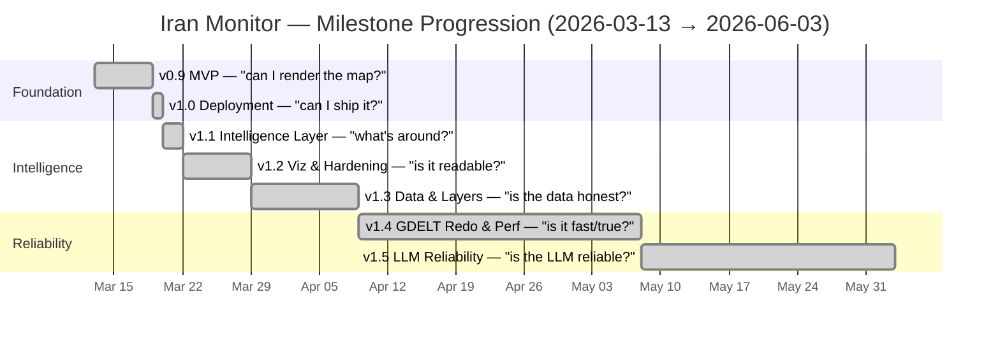

# The Journey: Iran Monitor, v0.9 → v1.5

> The first-person product arc, from a single brainstorm on 2026-03-13 to the
> v1.5 LLM-reliability close on 2026-06-03. Seven milestones, each answering one
> question.

This is the product story. For the _how-it-was-built_ meta-story (the agentic
`/gsd` workflow, what compounded, what I scrapped), see
[BUILDING-WITH-CLAUDE-CODE.md](./BUILDING-WITH-CLAUDE-CODE.md). For the
architecture, see [system-context.md](./architecture/system-context.md). This
document is the narrative arc — what I was actually trying to answer at each
step, and how the question kept getting harder.

Every date and figure below is sourced from
[`.planning/MILESTONES.md`](../.planning/MILESTONES.md) and
[`.planning/RETROSPECTIVE.md`](../.planning/RETROSPECTIVE.md). Nothing is invented.

---

## The timeline at a glance

The whole arc, as a GitHub-native Mermaid gantt. Each bar runs from the previous
milestone's ship date (or the project start) to its own ship date — the dates are
the canonical ship-date headers from
[`.planning/MILESTONES.md`](../.planning/MILESTONES.md).

> Dates verified against `.planning/MILESTONES.md` ship-date headers: v0.9
> 2026-03-19, v1.0 2026-03-20, v1.1 2026-03-22, v1.2 2026-03-29, v1.3 2026-04-09,
> v1.4 2026-05-08, v1.5 2026-06-03. The project opened with the
> [2026-03-13 brainstorm](./brainstorms/2026-03-13-iran-conflict-monitor-brainstorm.md).

The shape worth noticing: the milestones get _slower_ as they get more serious.
v0.9 → v1.2 are days apart — that's the feature-building phase, where I'm asking
"can I render this?" questions the agents answer fast. v1.4 took 29 days and v1.5
took 24 — that's the reliability phase, where every question is "is this telling
the truth?" and the answer needs measurement, not just code.

---

## v0.9 — MVP: "Can I even render this?"

**Shipped 2026-03-19 · 13 phases · 25/28 plans · 229 commits · 12,262 LOC · 6 days**

It started with [one brainstorm](./brainstorms/2026-03-13-iran-conflict-monitor-brainstorm.md)
and one question: _what is actually happening around the Strait of Hormuz right
now, quantitatively?_ Not a news feed. Not narratives. Numbers on a map.

The MVP answered the most basic version: can I put a 2.5D dark map with 3D terrain
on the screen, and can I get real entities onto it? Six days later the answer was
yes — multi-source flight tracking (OpenSky, ADS-B Exchange, adsb.lol), ship
tracking via AIS, GDELT v2 conflict events, zoom-responsive entity rendering,
layer toggles, hover tooltips, click-to-inspect detail panels, smart filters, and
an analytics-counter dashboard.

The early lesson that paid off all the way through: **plan for data-source
pivots.** I built adapter abstractions early, and when ACLED turned out to be a
dead end I swapped to GDELT through the same normalizer with almost no friction.
That adapter pattern is still load-bearing six milestones later.

## v1.0 — Deployment: "Can I actually ship it?"

**Shipped 2026-03-20 · 2 phases · 6/6 plans · 35 commits · 13,637 LOC · 2 days**

A working dev build is not a product. v1.0 answered "can this survive serverless?"
— which meant rethinking every piece of persistent state. In-memory caches became
Upstash Redis. The AISStream WebSocket became an on-demand connect-collect-close
model. GDELT got lazy on-demand backfill. The app went live on Vercel with
serverless functions and a CDN-served SPA.

The lesson: _serverless means rethinking any persistent state._ WebSocket
connections, in-memory caches, and polling loops all needed serverless-compatible
alternatives. The `CacheEntry<T>` pattern (`{data, fetchedAt}`) that cleanly
separates staleness from cache mechanics dates from here and is everywhere now.

## v1.1 — Intelligence Layer: "What's around the entities?"

**Shipped 2026-03-22 · 8 phases · 22/22 plans · 146 commits · 25,842 LOC · 851 tests · 3 days**

Flights and ships are dots. v1.1 asked: what's the _context_ around them? It added
key infrastructure sites (nuclear, naval, oil, airbase, port) from Overpass/OSM,
news aggregation (GDELT DOC + 5 RSS feeds) with Jaccard dedup/clustering, a
severity-scored notification center with proximity alerts, an oil-markets tracker
(Brent, WTI, XLE, USO, XOM), and a tag-based search language (~25 prefixes) with
bidirectional filter sync.

The lesson that mattered most: **cluster before you display.** Without dedup,
GDELT DOC returns dozens of near-identical articles for one event. Jaccard
similarity (0.8 threshold, 5-token minimum) was a pragmatic dedup strategy that
avoided NLP complexity entirely — a foreshadowing I'd ignore one milestone later
(see v1.3 below, and [ADR-0005](./adr/0005-phase-26-2-nlp-approach-scrapped.md)).

## v1.2 — Visualization & Hardening: "Is any of this readable?"

**Shipped 2026-03-29 · 7 phases · 19/19 plans · 129 commits · ~30,000 LOC · 958 tests · 7 days**

By now there was a lot on the map. v1.2 asked: is this _legible_, and does it
survive contact with real traffic? It introduced a visualization-layer
architecture (geographic elevation/contour, weather heatmap with wind barbs,
threat-density heatmap) cleanly separated from the entity toggles — because
"toggling off flights" and "showing a weather overlay" are orthogonal concerns
that had been confusingly tangled.

It also brought production hardening (Helmet CSP, rate limiting, structured
logging, Redis fallback) and multi-user load testing (k6 with 501 VUs + Playwright,
100% pass). The lesson: **visualization layers and data filters are orthogonal —
mixing them confuses users and complicates code.** And the one I'd relearn the
hard way: production hardening should be continuous, not a final phase.

## v1.3 — Data Quality & Layers: "Is the data actually honest?"

**Shipped 2026-04-09 · 11 phases · 36 plans · ~1,700 tests · 11 days**

This is the milestone with the scar. v1.3 was about data quality — and it's where
I spent two weeks building a server-side NLP geolocation pipeline to fix GDELT's
noisy coordinates, then scrapped all ~1,500 lines of it.

The full autopsy is [ADR-0005](./adr/0005-phase-26-2-nlp-approach-scrapped.md),
and it's the highest-signal artifact in the repo. The short version: I was
patching downstream of a bad signal, stacking five layers of mitigation on top of
each other, when the real fix was upstream. I should have spiked-and-measured
before committing. I deleted it instead of feature-flagging it, documented the
scrap honestly, and reframed the problem for a proper redo (which became v1.4).

The rest of v1.3 was genuinely strong: political boundaries, ethnic distribution
(GeoEPR-2021), water stress (WRI Aqueduct), threat-density clustering with
click-through detail panels, and a big production-quality push — Pino structured
logging, Zod-validated config, a hand-written OpenAPI 3.0.3 spec, strict
TypeScript with `noUncheckedIndexedAccess`, CI + CodeQL + gitleaks pre-commit
hooks, and the portfolio-grade README with its Playwright-captured hero GIF. The
lesson, learned by losing two weeks: **spike before you commit, and kill your
darlings.**

## v1.4 — GDELT Redo & Performance: "Is it fast, and is it true?"

**Shipped 2026-05-08 · 18 phases · 60/60 plans · 2,193 tests · 29 days**

v1.4 is the redo the NLP scrap set up — done right this time, upstream. Instead of
post-processing bad geocoding, it built a structured LLM extraction pipeline:
a single v3 extractor, a 6-path geocode resolver that never returns a coordinate
without provenance, a Zod-validated 5-type event ontology, and the full suite of
reliability primitives (circuit breaker, dead-letter queue, token budget,
watchdog). A daily eval harness scored extraction against 50 ground-truth events
across 11 countries.

This is also where the architecture got serious about not lying: the cron-driven
pipeline made `/api/events` cache-only (the cron is the sole writer), a big
cleanup sweep centralized domain constants with byte-identical server mirrors and
moved every color to CSS `@theme` tokens via a colorBridge, and a unified API
Health dashboard plus a production connectivity-audit workflow gave the system a
way to report its own truthfulness. 29 days, +493 tests. The lesson: when you fix
a problem upstream instead of patching it downstream, the whole system gets more
honest, not just the one feature.

## v1.5 — LLM Reliability & Reveal Prep: "Is the LLM pipeline actually reliable?"

**Shipped 2026-06-03 · 10 phases · 60/62 plans · 209 commits · 92,501 LOC · ~2,386 tests · 24 days**

The final v1.5 question was the hardest because it's the least visual: is the LLM
pipeline _reliable_, and does the system tell the truth about itself? Answering it
meant a lot of subtraction. The active runtime cascade narrowed to NIM-only
(OpenRouter declared dormant after a probe found it 90% rate-limited; Cerebras +
Groq honestly deferred). The v1 + v2 extractor modules were _deleted_ — ~6,400
lines — because their rollback path was `git revert`, so keeping them "for safety"
was just dead weight. Vercel went Pro ($20/mo) for the 800-second function ceiling
the LLM cron needs.

The "LLM-optional" architecture got proven mechanically: with all LLM credentials
unset, `/api/events` falls back to raw GDELT through the cache bridge and the map
never goes blank. Ghost-event URL liveness shipped end-to-end. Actor metadata got
a canonical 27-entry catalog with confidence scoring. And a fleet of mechanical
drift gates (a 32-key Redis registry test, OpenAPI lint, markdown-link-check) made
doc/code drift fail loudly at test time instead of surfacing months later in an
audit.

The milestone closed on an acceptance gate that, when I finally let it run,
uncovered a real architectural mismatch — four unblocker PRs (#32-#35) reconciled
the gate's strict-tier-green semantics with the LLM-optional architecture v1.4 had
shipped. The lessons here are the deepest in the project:
[deep rollback safety is technical debt, not safety](./adr/0010-v1-5-llm-pipeline-narrowing-and-deletion.md);
a 7-day watch needs to actually be 7 days; and acceptance gates that don't observe
shipped reality are worse than no gate. The full retrospective lives in
[`.planning/RETROSPECTIVE.md`](../.planning/RETROSPECTIVE.md).

---

## …and onward to v1.6

v1.5 closed clean and unblocked v1.6. The work since has been about turning a
reliable system into a _legible_ one — production hardening and the operator/
observability surfaces that make the pipeline auditable:

- **An operator budget surface** — a BudgetBlock plus cost-shadow accounting that
  surfaces the daily LLM token spend so the single-user free-tier budget is
  visible, not a surprise.
- **An LLM Flight Recorder** — per-call and per-run history recorders
  (`llm:calls:history` / `llm:runs:history`, served at `/api/events/llm-history`)
  that survive Vercel Fluid Compute cold starts, so a run that died mid-flight
  leaves a "this run died" signal instead of vanishing.
- **Water-facility romanization** — non-Latin water-facility names now carry both
  `nameLatin` and `nameOriginal`, so the map is readable regardless of script.
- **A consolidated API-Health dashboard** — the operator surface reorganized into
  a hero rollup plus four collapsible diagnostic groups, turning a wall of metrics
  into a scannable health view.

This very document — and the portfolio reveal it's part of — is the closing move
of v1.6: making the whole journey, including the failures, legible to anyone who
wants to see how a 90,000-line app actually gets built. The next question the
project is answering is the one you're helping answer by reading this: _can
someone else look at this and learn how to do it themselves?_

---

_For the agentic-dev meta-story, see
[BUILDING-WITH-CLAUDE-CODE.md](./BUILDING-WITH-CLAUDE-CODE.md). For the guided
portfolio tour, see [SHOWCASE.md](./SHOWCASE.md). All dates sourced from
[`.planning/MILESTONES.md`](../.planning/MILESTONES.md)._
